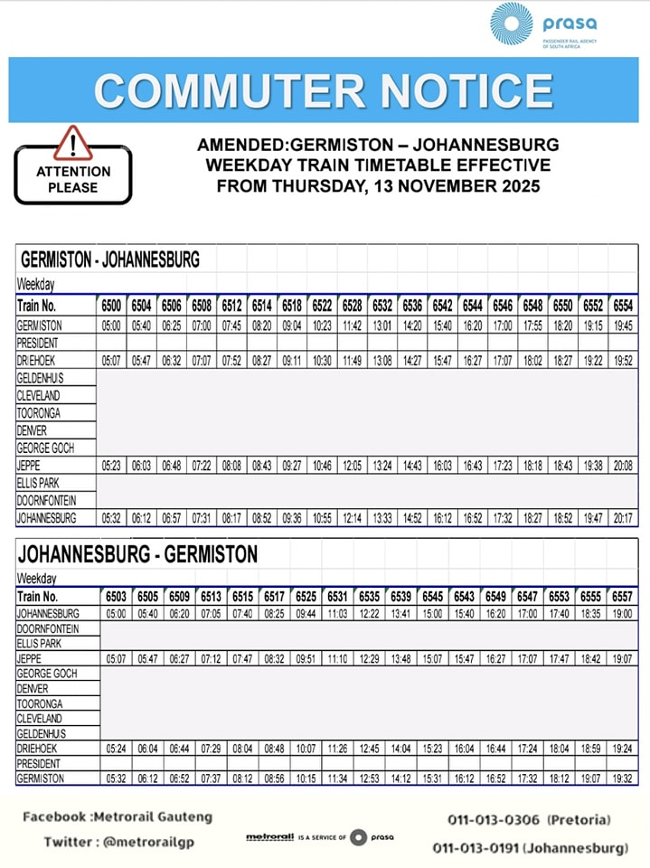
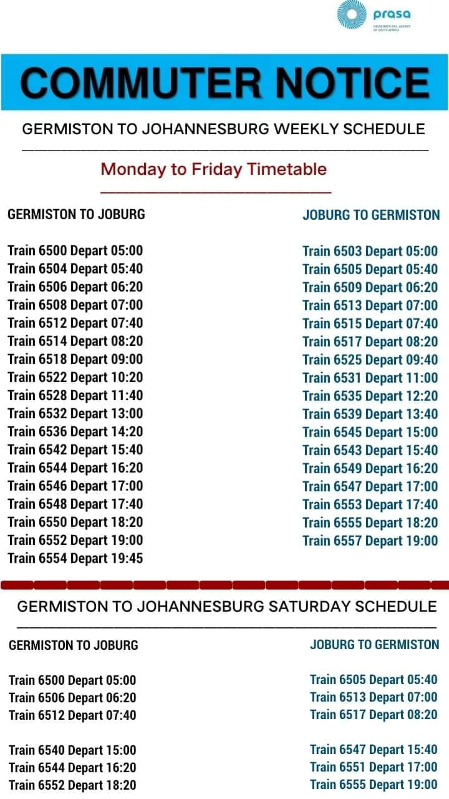
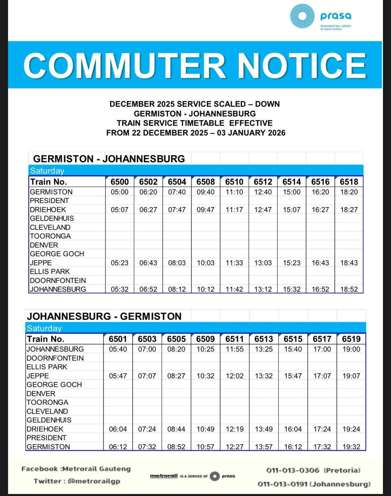

## Transfer stations

* [Germiston](../stations/germiston)
* [Johannesburg](../stations/johannesburg)

## Timetable

### Weekdays

[Issued 2025-11-12](https://www.facebook.com/photo.php?fbid=1294531519378844&set=pb.100064660243057.-2207520000&type=3)

### Saturdays and holidays

[Issued 2025-10-28](https://www.facebook.com/photo.php?fbid=980719967426669&set=pb.100064660243057.-2207520000&type=3)

See the [December 2025 scaled-down timetable](https://www.facebook.com/photo.php?fbid=1324898749675454&set=pb.100064660243057.-2207520000&type=3) for the travel times of the trains:

## How to help out

If you encounter any issues with the timetables, or if you notice that a new timetable is posted, please open an issue at <https://github.com/gauteng-transit/gauteng-transit.github.io/issues> or contact us via email at <gauteng-transit@googlegroups.com>.
